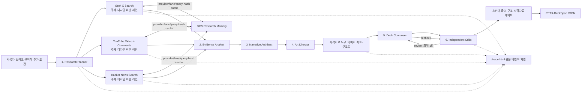

# DeckForge X Agentic Engineering 파이프라인·실험 가이드

작성 기준: 2026-08-02 현재 로컬 코드와 `.env` 설정  
대상: Creative 트랙 제출, 2분 영상, 7분 결선 라이브 데모, 사용자 반려 기반 후속 실험

## 1. 한 문장 정의

DeckForge X는 X, YouTube 공개 댓글, Hacker News 토론에서 현재 대화 신호를 수집하고, 정확히 여섯 개의 GPT 역할이 근거 분석 → 서사 → 아트 디렉션 → DeckSpec → 독립 비평을 수행한 뒤, 결정론적 코드가 같은 실행에서 검증된 DeckSpec만 PPTX로 렌더링하는 에이전트다.

중요한 경계는 다음과 같다.

- GPT는 기획·분석·서사·디자인 판단을 담당한다.
- Grok은 X 검색에만 사용한다.
- YouTube 영상·댓글 검색, Hacker News 검색, 범용 시각자료 처리, GCS 캐시, 검증, 렌더링은 도구 또는 코드이지 추가 에이전트가 아니다.
- X 게시물, YouTube 댓글, Hacker News 토론은 “사람들이 이렇게 말하고 있다”는 대화 근거이며, 그 내용이 사실임을 자동 증명하지 않는다.
- 국가별 불만 신호는 X를 우선하며, 영상 언어·채널 위치로 YouTube 댓글 작성자의 국가를 추정하지 않는다.
- 모델이 만든 출처·이미지 경로를 신뢰하지 않고, 코드가 같은 실행의 화이트리스트와 해시를 다시 대조한다.

## 2. 전체 파이프라인



순서의 의도는 명확하다. 검색 계획 전에 슬라이드를 쓰지 않고, 근거 분석 전에 서사를 만들지 않으며, 서사가 확정되기 전에 레이아웃과 시각자료 유형을 고르지 않는다. 비평은 덱을 만든 모델 컨텍스트와 분리되어 있고, 최종 렌더러는 모든 게이트를 통과한 동일 DeckSpec만 받는다.

## 3. 에이전트별 모델·역할·출력 계약

현재 `.env`의 실제 모델 라우팅은 아래와 같다. 모델 이름은 환경변수로 언제든 교체할 수 있다.

| 번호 | 역할 | 모델 티어 | 현재 모델 | 역할별 최대 출력 토큰 | 핵심 출력 |
|---:|---|---|---|---:|---|
| 1 | Research Planner | fast | `gpt-5.6-luna` | 12,000 | `ResearchPlan` + 발표 프로필 |
| 2 | Evidence Analyst | fast | `gpt-5.6-luna` | 24,000 | `CommunityEvidence` |
| 3 | Narrative Architect | critical·deep | `gpt-5.6-sol` high | 32,000 | `NarrativeSpec` |
| 4 | Art Director | critical·standard | `gpt-5.6-sol` medium | 24,000 | `VisualSystemSpec` |
| 5 | Deck Composer | critical·standard | `gpt-5.6-sol` medium | 32,000 | `ComposedDeck` |
| 6 | Independent Critic | critical·standard | `gpt-5.6-sol` medium | 20,000 | `CritiqueReport` |
| 도구 | Grok X retrieval | X Search 전용 | `grok-4.5` | 900 | `XResearchResult` |
| 도구 | YouTube/HN retrieval | 결정론적 HTTP | 모델 없음 | 0 | `CommunityPost[]` |

수리 시 새로운 일곱 번째 에이전트가 생기지 않는다. Deck Composer가 `stage=repair`로 한 번 더 호출되고, Independent Critic이 `stage=recheck`로 한 번 더 호출된다. 따라서 정상 실행은 모델 역할 호출 6회, 수리 실행은 최대 8회지만 고유 역할은 여전히 6개다.

전체 실행은 GPT 사용량 전용 `AGENT_MAX_TOTAL_TOKENS` 기본 500,000 토큰 안전 예산을 가진다. 역할별 상한은 `AGENT_PLANNER_MAX_OUTPUT_TOKENS`부터 `AGENT_REPAIR_MAX_OUTPUT_TOKENS`까지 환경변수로 독립 조정한다. 기본 초기 6개 역할의 출력 상한 합계는 144,000이며, 전체 예산은 입력·추론·스키마 재시도·1회 수리와 재검토까지 여유를 둔다. 각 상한은 예약량이 아니라 최대치라 실제 사용량만 과금된다. Grok X 검색은 읽은 게시물 전체를 input 토큰으로 계상해 레인당 10만 토큰을 넘는 것이 정상이므로, 이 예산에서 분리해 별도 관측치로만 보고한다(출력은 `GROK_MAX_OUTPUT_TOKENS`, 호출 수는 레인당 1회로 이미 제한된다). 실행 시작 시 예산이 6개 역할의 출력 상한 합계보다 작으면 아무 호출 없이 즉시 중단하고, 각 역할 호출 전에는 남은 예산이 해당 역할의 출력 상한을 감당하는지 검사한다. 역할이 출력 상한에서 잘리면 불완전한 JSON을 억지로 파싱하지 않고 실행을 중단하며, 스키마 위반은 위반 내용을 피드백으로 붙여 1회 재시도한 뒤에만 실패로 처리한다.

### 3.1 Research Planner

입력:

- 사용자 브리프
- 선택적으로 입력한 한 줄의 추가 조건
- 3~5장 슬라이드 상한과 언어
- 코드가 확정한 최대 3개 시장과 검색 언어
- 실제 생성 모델과 렌더러 정보

하는 일:

- `topic`: 주제 자체의 불만·마찰·미충족 요구를 찾는 쿼리
- `design_critique`: 이 주제를 AI 프레젠테이션으로 표현할 때 생기는 디자인 비판을 찾는 쿼리
- X, YouTube, Hacker News에서 모두 작동하는 집중 검색어 두 개
- 브리프와 추가 조건에서 목적·청중·상황·말투·시각 방향을 추론한 공유 `presentationProfile`

선택 기준:

- 전체 브리프를 그대로 검색하지 않고 한 가지 문제를 찾는 집중 쿼리를 만든다.
- 사용자가 명시한 조건은 그대로 보존하고, 빠진 맥락만 보수적으로 추론한다.
- 추론한 조건과 가정은 `/trace.html`의 `presentation_context_resolved` 이벤트에서 확인한다.
- 두 레인의 근거를 섞지 않는다.
- 시장은 모델이 추가하지 못한다. 코드가 모델 출력의 시장 목록을 사전 결정된 시장으로 다시 덮어쓴다.
- 이 단계에서는 발견이나 슬라이드를 작성하지 않는다.

출력 형태:

```json
{
  "topicQuery": "...",
  "designCritiqueQuery": "...",
  "markets": [{ "country": "South Korea", "searchLanguage": "ko" }],
  "rationale": "..."
}
```

### 3.2 Evidence Analyst

입력:

- 중복 제거된 `CommunityPost[]`
- 레인별 검색 경고와 제한사항

하는 일:

- 주제 불만과 디자인 불만을 각각 최대 6개 finding으로 군집화한다.
- 지역 차이, 모순, 디자인 상투성, 소스 한계를 별도 필드로 남긴다.
- 각 finding은 실제 공급된 URL 1~3개만 사용할 수 있다.

선택 기준:

- URL로 지지되지 않는 finding은 코드에서 제거된다.
- 검색 결과가 비어 있는 레인을 다른 레인의 게시물이나 사전지식으로 채우지 않는다.
- 게시물의 주장 자체를 사실로 판정하지 않는다.
- 참여 수치·인용문·인구통계·사실을 만들어내지 않는다.

현재의 판단 여지:

- `confidence: low | medium | high`의 세부 점수 앵커는 아직 프롬프트에 수치화되어 있지 않다.
- 실험에서는 `high=서로 다른 작성자의 2개 이상 URL`, `medium=구체적인 1개 URL 또는 약한 반복`, `low=단일·모호·오래된 신호`처럼 명시적 앵커를 추가하는 것이 좋다.

출력 형태:

- `topicComplaints[]`
- `designComplaints[]`
- `designCliches[]`
- `regionalDifferences[]`
- `contradictions[]`
- `sourceLimitations[]`

### 3.3 Narrative Architect

입력:

- 브리프
- `CommunityEvidence`
- 검색 출처 화이트리스트

하는 일:

- 3~5장의 짧은 의사결정 서사를 만든다.
- 각 슬라이드에 claim, purpose, visualRole, evidenceUrls, visiblePoints, presenterNote를 지정한다.

선택 기준:

- 첫 장은 방향 선언, 마지막 장은 종합 또는 행동 요청이어야 한다.
- 한 슬라이드에는 한 주장과 한 목적만 둔다.
- 근거가 부족한 비트는 삭제하거나, 출처 없는 열린 질문으로 표현한다.
- 색상·폰트·레이아웃·이미지 스타일은 선택하지 않는다.
- evidence URL은 카탈로그에 존재하는 URL만 남도록 코드가 다시 필터링한다.

출력 형태: `NarrativeSpec`의 3~5개 `narrativeSlide`.

### 3.4 Art Director

입력:

- 브리프와 사용자 시각 선호
- 커뮤니티 디자인 비판과 상투성
- `NarrativeSpec`
- 사용자 업로드 파일의 이름·보드 라벨·크기
- 공식 이미지 URL과 Dribbble·공개 보드 링크
- 현재 사용할 수 있는 이미지 공급자와 네이티브 PowerPoint 차트·구조도 capability

하는 일:

- 덱 전체 aesthetic intent를 만든다.
- 모든 narrative slide ID에 정확히 하나의 visual directive를 같은 순서로 매핑한다.
- 각 슬라이드의 `visualAssetType`을 `none`, `photo`, `screenshot`, `chart`, `diagram` 중 하나로 정한다.
- 외부 사진·스크린샷이 필요할 때만 검색어, 목적, 방향, 선호 소스를 담은 `ImageIntent`를 만든다.

선택 기준:

- 주제, 청중, 사용자 선호, narrative 역할, 커뮤니티가 비판한 디자인 상투성을 함께 본다.
- 지원 레이아웃 `hero`, `evidence_focus`, `split`, `steps`, `statement`, `image_focus`, `chart_focus`, `diagram_flow` 중 하나만 고른다.
- 이미지 중심 본문은 `image_focus`, 표지는 `hero`, 마지막은 `statement`를 사용한다.
- 실제 비교 가능한 숫자가 최소 2개 있을 때만 `chart_focus`, 순서·의존성·핸드오프가 문장보다 명확해질 때만 `diagram_flow`를 사용한다.
- 사용자 업로드·공식 이미지는 해당 주장에 실제 도움이 될 때만 우선한다.
- Dribbble과 보드는 디자인 참고이지 사실 근거나 복제할 이미지가 아니다.
- 네온 AI 스타일 같은 기본 상투성을 주제상 이유 없이 선택하지 않는다.

출력 형태:

- `aestheticIntent`: theme, rationale, mood, layoutLogic, imageLogic, avoid
- `slideDirectives[]`: slideId, layout, composition, visualAssetType, imageNeed, imageIntent, emphasis, avoid

### 3.5 Deck Composer

입력:

- `NarrativeSpec`
- `VisualSystemSpec`
- 같은 실행에서 선택된 이미지 메타데이터와 네이티브 차트·구조도 계획
- 출처 카탈로그

하는 일:

- 서사와 아트 디렉션을 정확한 `DeckSpec` 스키마로 조립한다.
- 제목, takeaway, 불릿, stats, 노트를 발표 가능한 밀도로 정리한다.

선택 기준:

- narrative의 슬라이드 ID·순서·visualRole·evidence URL을 보존한다.
- Art Director의 visualDirective를 고치지 않고 그대로 복사한다.
- citation의 URL·제목·작성자·excerpt는 source catalog에서만 복사한다.
- 새로운 출처, 수치, 인용, 핸들, 디자인 근거를 만들지 않는다.
- 이미지 ID·경로·해시는 작성하지 않는다. 모델 응답 후 코드가 같은 실행의 이미지 자산을 고정 주입한다.
- 차트 숫자는 사용자가 제공한 사실에서만 복사하고, 구조도 노드는 NarrativeSpec의 관계를 짧은 불릿으로 표현한다.

출력 형태: 3~5장 `DeckSpec`.

### 3.6 Independent Critic

입력:

- 브리프, Evidence, Narrative, Visual System, 선택 이미지·네이티브 시각자료 계획, 완성 DeckSpec

하는 일:

- 덱을 만들지 않은 독립 컨텍스트에서 오류를 찾는다.
- 대체 덱이 아니라 슬라이드 단위의 국소 수리 지시를 반환한다.

선택 기준:

- 근거 없는 주장
- 일반적인 AI 문구
- 반복되는 레이아웃
- 주제와 미학의 불일치
- 커뮤니티가 지적한 디자인 상투성
- 사용자 말투 미반영
- 발표 가독성
- 사진·스크린샷 목적 불일치와 장식적 차트·구조도

출력 형태:

```json
{
  "verdict": "pass | revise",
  "scores": {
    "grounding": 0,
    "narrative": 0,
    "topicAestheticFit": 0,
    "userVoice": 0,
    "antiCliche": 0
  },
  "issues": [{
    "category": "grounding | narrative | design | voice | cliche | readability",
    "severity": "warning | error",
    "slideId": "signal",
    "instruction": "..."
  }],
  "summary": "..."
}
```

현재 다섯 점수는 0~100 범위만 스키마로 강제하고 점수별 상세 앵커는 모델 판단에 남아 있다. 팀 간 비교 실험을 하려면 각 점수에 20점 단위 앵커를 추가해야 한다. 최종 통과는 점수 평균이 아니라 `verdict=pass`이고 error-level issue가 없는지를 기준으로 한다.

## 4. X·YouTube·Hacker News 리서치 데이터 수량과 선정 방식

### 4.1 현재 기본 수량

현재 `X_MAX_POSTS=6`, `YOUTUBE_MAX_POSTS=6`, `HACKER_NEWS_MAX_POSTS=4`의 기본값을 두 레인에 나눠 배분한다.

| 플랫폼 | 레인 | 공급자 후보 상한 | 최종 선택 상한 |
|---|---|---:|---:|
| X | topic | 5 | 3 |
| X | design_critique | 5 | 3 |
| YouTube | topic | 영상 3개, 영상당 댓글 20개 | 3 |
| YouTube | design_critique | 영상 3개, 영상당 댓글 20개 | 3 |
| Hacker News | topic | 12 | 2 |
| Hacker News | design_critique | 12 | 2 |
| 합계 | 6개 플랫폼·레인 조합 | X 10개 + YouTube 댓글 최대 120개 + HN 24개 | 최대 16개 최종 레코드 |

설명:

- X 후보 수는 각 레인에서 `max(최종 3, ceil(X_SEARCH_CANDIDATES 10 / 2)) = 5`다.
- YouTube는 각 레인에서 관련 영상 최대 3개를 찾고, 영상당 상위 댓글 최대 20개를 정규화한 뒤 최종 3개를 고른다.
- URL 중복, 날짜 범위, 스키마 실패, 검색 실패 때문에 실제 개수는 상한보다 작을 수 있다.
- 여섯 결과를 합친 뒤 URL을 다시 중복 제거하고 source catalog를 최대 16개로 제한한다.
- usable source가 한 개도 없으면 덱 생성을 중단한다.

### 4.2 X 선정 방식

Grok은 분석가가 아니라 retrieval worker 프롬프트를 받는다.

1. 주제 또는 디자인 비판의 집중 쿼리를 받는다.
2. 시장별 검색 언어, 날짜, 허용 핸들을 적용한다.
3. 5개 후보 중 직접 X URL이 있는 실제 게시물을 수집한다.
4. 중복, 홍보, 링크 팜, 직접 URL이 없는 결과를 제외하도록 지시한다.
5. 코드가 `x.com` 또는 `twitter.com` URL만 정규화하고 URL 기준으로 중복 제거한다.
6. 최종 3개를 아래 점수로 정렬한다.

```text
engagement = min(1, log1p(likes + 2 × reposts) / log1p(10000))
recency = 30일 이내 1.0 / 90일 이내 0.7 / 365일 이내 0.35 / 그 외 0
X rank score = 0.65 × engagement + 0.35 × recency
```

동점이면 공급자 응답의 원래 순서를 유지한다. 노출되지 않은 참여 수치는 0으로 취급하며 추정하지 않는다.

### 4.3 YouTube 선정 방식

1. Planner의 집중 쿼리로 YouTube `search.list`를 호출해 관련 영상 최대 3개를 고른다.
2. 선택한 시장별로 영상 후보 수를 배분하고 `regionCode`, `relevanceLanguage`, 날짜, safe-search를 적용한다.
3. 각 영상의 `commentThreads.list`를 relevance 순으로 호출해 최상위 댓글만 수집한다.
4. 댓글 본문을 최대 280자로 제한하고 댓글 직접 URL, 작성 시각, 좋아요·답글 수를 보존한다.
5. 댓글 작성 시각도 명시된 날짜 범위 안인지 코드로 다시 검사한다.
6. 최종 3개를 아래 점수로 정렬하되 먼저 서로 다른 영상에서 하나씩 선택한다.

```text
signal = 결정론적 불만·비판 마커 점수 (순수 칭찬 0, 중립 0.25, 비판 최대 1.0, 40자 미만은 절반)
popularity = min(1, log1p(likes + 2 × replies) / log1p(10000))
recency = 30일 이내 1.0 / 90일 이내 0.7 / 365일 이내 0.35 / 그 외 0
YouTube rank score = 0.5 × signal + 0.3 × popularity + 0.2 × recency
```

signal이 0인 순수 칭찬 댓글은 후보에서 제외한다. 두 레인의 목적이 불만·비판 수집이므로, 좋아요가 아무리 많아도 칭찬은 그 근거가 될 수 없다.
YouTube API의 영상·댓글 검색은 relevance 정렬을 사용하지만, 최종 handoff 전에는 코드의 signal·popularity·recency 점수와 영상 다양성으로 다시 정렬한다. `discoveryMarket`은 해당 콘텐츠 지역 검색에서 발견됐다는 뜻이며 댓글 작성자의 국가는 빈 값으로 남긴다.

### 4.4 Hacker News 선정 방식

1. HN Search API를 story/comment 통합 태그로 레인당 한 번 호출한다.
2. 날짜 범위를 epoch numeric filter와 코드 후처리로 이중 적용한다.
3. `news.ycombinator.com/item?id=...` 직접 URL, 본문, 작성자, 점수·댓글 수만 정규화한다.
4. `0.5 × signal + 0.3 × popularity + 0.2 × recency`로 정렬해 레인당 최종 2개를 고르며, 불만·비판 마커가 없는 순수 칭찬·홍보성 글은 후보에서 제외한다.
5. Hacker News는 국가·인구통계 신호가 아니라 기술 사용자·창업자 관점의 보조 근거다.

### 4.5 데이터가 평가에 활용되는 방식

참여량이나 최신성 점수가 최종 덱 품질 점수에 직접 더해지지는 않는다. 이 점수는 “Evidence Analyst에게 어떤 게시물을 보여줄 것인가”를 정하는 검색 랭킹이다.

최종 활용 단계는 다음과 같다.

1. 최대 16개 레코드가 공통 `CommunityPost`로 정규화된다.
2. Evidence Analyst가 URL 기반 finding을 만든다.
3. Narrative Architect는 finding과 source catalog에 있는 URL만 사용한다.
4. Deck Composer는 citation을 직접 쓰지 않는다. 코드가 NarrativeSpec의 evidence URL과 source catalog 메타데이터를 슬라이드 ID 기준으로 결정론적으로 바인딩하므로, catalog 밖 출처나 변조된 title·handle·excerpt는 구조적으로 덱에 들어갈 수 없다.
5. visualDirective와 aestheticIntent도 같은 방식으로 Art Director 산출물에서 코드가 바인딩하며, Composer가 바꿀 수 있는 것은 슬라이드 ID·순서·visual role과 카피뿐이다. 이것이 어긋나면 `NARRATIVE_ORDER_DRIFT`/`NARRATIVE_ROLE_DRIFT`로 차단된다.
6. Evidence/case 슬라이드에 citation이 없거나, 수치에 허용된 X·YouTube·Hacker News URL이 없으면 렌더링을 차단한다.
7. 디자인 비판 레인의 결과는 Art Director가 피해야 할 상투성과 레이아웃 선택에 활용한다.

즉, 리서치 점수는 입력 선택용이고, 최종 평가는 출처 충실도·서사·디자인 의도·리듬·비평 결과로 이루어진다.

## 5. GCS 저장 구조

### 5.1 현재 구현된 Research Memory v4

각 플랫폼과 레인을 별도 객체로 저장한다.

```text
{GCS_PREFIX}/v5/x/topic/{sha256(identity)}.json
{GCS_PREFIX}/v5/x/design_critique/{sha256(identity)}.json
{GCS_PREFIX}/v5/youtube/topic/{sha256(identity)}.json
{GCS_PREFIX}/v5/youtube/design_critique/{sha256(identity)}.json
{GCS_PREFIX}/v5/hacker_news/topic/{sha256(identity)}.json
{GCS_PREFIX}/v5/hacker_news/design_critique/{sha256(identity)}.json
```

identity hash에는 다음이 정규화되어 들어간다.

- platform, lane
- query
- country와 search language
- maxPosts
- fromDate, toDate
- X allowed handles, YouTube videoCandidates·commentsPerVideo·relevanceLanguage, 또는 HN searchCandidates

검색어 원문은 객체 이름에 노출되지 않고 저장 레코드에도 별도 `query` 필드로 남지 않으며 SHA-256 identity에 반영된다. 다만 X의 `extract`나 게시물 excerpt가 주제를 다시 언급할 수 있으므로 버킷은 비공개로 유지해야 한다.

X 레코드:

- version, platform, lane
- collectedAt, expiresAt
- markets, sourceCount
- 최대 6,000자 extract
- 최종 선택된 citations

YouTube 레코드:

- version, platform, lane
- collectedAt, expiresAt
- markets, sourceCount
- 최종 선택된 comments와 검사한 영상 수

Hacker News 레코드:

- version, platform, lane, collectedAt, expiresAt
- markets, sourceCount, 최종 선택된 story/comment 레코드

공통 정책:

- 기본 TTL은 24시간이다.
- 만료된 객체는 재사용하지 않지만 코드가 자동 삭제하지는 않는다. 버킷 lifecycle 삭제 규칙이 필요하다.
- GCS hit이면 공급자 호출 없이 동일한 정규화 결과를 사용하고 공급자 토큰 사용량은 0이다.
- read/write 실패는 경고로 남고 실시간 검색 결과가 있으면 파이프라인은 계속된다.
- 객체는 `private, no-store` cache control로 저장한다.

`GCS_MEMORY_ENABLED=false`이면 버킷과 프로젝트가 있어도 X·YouTube·Hacker News 데이터가 GCS에 저장되거나 재사용되지 않는다. 실제 활성 여부는 `.env`와 `/api/health`로 확인한다.

### 5.2 현재 GCS에 저장되지 않는 것

- 최종 DeckSpec과 PPTX
- Independent Critic 점수
- deterministic evaluation 점수
- 사용자 승인·반려 이유
- 이미지 파일
- 전체 trace 이벤트

이 항목을 저장하려면 Research Memory와 섞지 말고 별도의 버전·prefix·보존정책을 사용해야 한다.

## 6. 현재 품질 평가와 최종 렌더 조건

### 6.1 Independent Critic의 모델 평가

| 지표 | 의미 | 현재 강제 방식 |
|---|---|---|
| grounding | 주장이 공급된 근거를 벗어나지 않는가 | 0~100 + issue |
| narrative | 주장 순서와 결론이 의사결정에 적합한가 | 0~100 + issue |
| topicAestheticFit | 주제·청중과 시각 방향이 맞는가 | 0~100 + issue |
| userVoice | 사용자가 요청한 말투와 관점이 반영됐는가 | 0~100 + issue |
| antiCliche | 커뮤니티가 싫어한 AI 디자인 상투성을 피했는가 | 0~100 + issue |

점수 앵커는 아직 모델 판단이다. 대신 `pass`는 error-level issue가 하나도 없을 때만 허용된다.

### 6.2 결정론적 Deck Evaluation

네 차원을 각각 100점에서 감점하고 평균한다.

- narrative: 표지 선언 역할, 마지막 종합·행동 역할, 일반적인 제목
- visualIntent: 미학 rationale의 구체성, 피할 상투성 명시
- rhythm: 본문 레이아웃 반복 여부
- grounding: 본문 출처와 evidence/case 출처 존재

`score >= 70`이고 error가 없어야 `ready=true`다.

### 6.3 코드 validator·handoff gate

다음 조건은 점수로 상쇄할 수 없는 hard gate다.

- DeckSpec 스키마
- 3~5장, 첫 장 title/hero, 마지막 장 closing/statement
- 중복 slide ID 금지
- 레이아웃에 필요한 citation·bullet 존재
- 본문 takeaway 존재
- 수치에는 X 또는 YouTube URL 존재
- narrative 순서·visualRole·evidence URL 보존
- Art Director directive 완전 일치
- citation URL과 메타데이터가 source catalog와 완전 일치
- required 이미지 존재, slide ID 일치
- 동일 실행에서 선택한 이미지의 경로·asset ID·SHA-256 일치
- chart는 실제 숫자형 stats 최소 2개와 `chart_focus`가 일치
- diagram은 2개 이상의 노드 불릿과 `diagram_flow`가 일치

최종 렌더 조건은 아래 네 가지를 모두 만족하는 것이다.

```text
schema/code fatal issue = 0
deterministic evaluation.ready = true
Independent Critic verdict = pass
render 대상 = 같은 실행에서 검증된 정확히 동일한 DeckSpec
```

## 7. 사용자 반려를 GCS에 저장하고 재검색할 것인가

### 결론

좋은 방향이지만 “반려하면 항상 세 공급자 전체 재검색”은 비효율적이다. 반려 이유를 구조화하고, 외부 대화 근거가 결과를 바꿀 수 있는 이유일 때만 한 개 레인과 필요한 공급자를 선택해 재검색하는 것이 좋다.

현재 코드에는 이 feedback loop가 아직 구현되어 있지 않다. 아래는 다음 실험 단계의 권장 설계다.

### 7.1 반려 이유별 라우팅

| 사용자 반려 이유 | 재검색 | 다시 호출할 역할 |
|---|---|---|
| 근거가 약함·출처가 신뢰되지 않음 | topic 레인 X·YouTube·HN 각 1회 | Planner → Evidence → Narrative → Composer → Critic |
| 최근 흐름이 빠짐·데이터가 오래됨 | 해당 레인의 필요한 공급자만 1회 | Planner → Evidence 이후 downstream |
| 특정 지역·사용자 관점이 빠짐 | topic 레인에 시장·관점 delta를 넣어 각 1회 | Planner → Evidence 이후 downstream |
| 문제 설정 자체가 빗나감 | 새 child run으로 전체 재계획 | 여섯 역할 전체 |
| 스토리 순서가 혼란스러움 | 하지 않음 | Narrative → Composer → Critic |
| 문구가 장황하거나 내 말투가 아님 | 하지 않음 | Composer → Critic |
| 디자인·시각자료가 별로임 | 보통 하지 않음 | Art Director → 시각자료 도구 → Composer → Critic |
| AI 덱처럼 상투적임 | design_critique 레인만 각 1회 가능 | Planner → Evidence → Art Director 이후 downstream |

### 7.2 권장 recovery 규칙

- 한 반려당 `recoveryRound=1`만 허용한다.
- 전체 검색을 반복하지 말고, 선택된 한 레인에서 X retrieval 1회 + YouTube retrieval 1회만 실행한다.
- 기본 recovery 상한은 X 최종 3개 + YouTube 댓글 최종 3개, 총 최대 6개 새 레코드다.
- 새 결과와 기존 결과를 URL로 중복 제거한다.
- 원본 run과 artifact는 수정하지 않고, `parentRunId`를 가진 새 child run을 만든다.
- 새 근거가 없으면 기존 결과를 억지로 바꾸지 않고 “recovery가 새로운 근거를 찾지 못함”을 명시한다.
- 사용자에게 외부 GCS 저장과 재검색을 명시하고, `반려만 저장`과 `반려 저장 후 재탐색`을 별도 버튼으로 제공한다.
- 자유 텍스트는 최대 500자, 이메일·이름·API 키·개인정보는 저장 전에 제거한다.

### 7.3 Feedback Event 제안

Research Memory와 별도 prefix를 사용하고 한 객체를 append 수정하지 말고 이벤트마다 immutable 객체를 만든다.

```text
deckforge-x/feedback/v1/{yyyy-mm-dd}/{runId}/{feedbackId}.json
```

```json
{
  "version": 1,
  "feedbackId": "uuid",
  "runId": "uuid",
  "parentRunId": null,
  "deckSha256": "...",
  "createdAt": "2026-08-02T00:00:00.000Z",
  "decision": "reject",
  "reasonCodes": ["evidence_weak", "missing_perspective"],
  "affectedSlideIds": ["signal"],
  "freeText": "개인정보 제거 후 최대 500자",
  "researchDecision": {
    "shouldResearch": true,
    "lane": "topic",
    "queryDelta": "한국의 실제 실무 사용자 관점",
    "maxRecoveryRound": 1
  },
  "consent": {
    "storeFeedback": true,
    "runExternalResearch": true
  }
}
```

## 8. 평가 지표를 지식 그래프로 저장할 것인가

### 결론

감사 가능성과 반복 실험에는 유용하다. 하지만 “전체 그래프를 매 실행 프롬프트에 첨부”하는 방식은 피해야 한다.

토큰을 많이 쓰는 것은 그래프 저장이 아니라 그래프를 모델 입력으로 직렬화하는 과정이다. 노드·엣지를 코드로 생성하고 GCS에 저장하는 것은 모델 토큰을 사용하지 않는다. 모델에는 현재 run, 선택된 feedback, 직접 연결된 source의 1-hop subgraph만 최대 개수 제한을 두고 전달하면 된다.

### 8.1 권장 노드

| 노드 | 식별자 | 주요 속성 |
|---|---|---|
| Run | runId | timestamp, model config, parentRunId |
| Query | queryHash | platform, lane, markets, date window |
| Post | canonical URL hash | platform, author, postedAt, engagement |
| Finding | findingId | complaint, confidence |
| Slide | runId + slideId | role, claim, layout |
| Image | assetId | provider, source URL, SHA-256 |
| Metric | runId + metricName | value, evaluator, version |
| Feedback | feedbackId | decision, reasonCodes |
| Artifact | deckSha256 | pptx/json filenames |

### 8.2 권장 엣지

| 엣지 | 의미 |
|---|---|
| `PLANNED_QUERY` | Run → Query |
| `RETRIEVED` | Query → Post |
| `SUPPORTS` | Post → Finding 또는 Slide |
| `CONTRADICTS` | Post → Finding |
| `USED_IN` | Finding → Slide |
| `SELECTED_FOR` | Image → Slide |
| `MEASURED` | Metric → Run |
| `CRITIQUES` | Feedback → Slide 또는 Run |
| `TRIGGERED_RECOVERY` | Feedback → child Run |
| `REVISED_TO` | parent Run → child Run |
| `PRODUCED` | Run → Artifact |

연결은 모델의 자유 연상이 아니라 현재 계약에 이미 존재하는 ID·URL·slideId로만 생성해야 한다. `SUPPORTS`는 Evidence Analyst의 `sourceUrls`, `USED_IN`은 NarrativeSpec의 `evidenceUrls`, `CRITIQUES`는 사용자가 선택한 affectedSlideIds에서 결정한다. 이렇게 하면 연결 기준이 모호해지는 문제를 줄일 수 있다.

### 8.3 GCS 저장 제안

GCS는 그래프 데이터베이스가 아니므로 소규모 실험에서는 run별 edge list로 사용한다.

```text
deckforge-x/graph/v1/runs/{runId}/nodes.jsonl
deckforge-x/graph/v1/runs/{runId}/edges.jsonl
deckforge-x/graph/v1/runs/{runId}/summary.json
```

예시 edge:

```json
{"from":"post:sha256(url)","type":"SUPPORTS","to":"finding:abc","provenance":{"runId":"...","lane":"topic"}}
```

토큰 통제 규칙:

- 전체 그래프를 프롬프트에 넣지 않는다.
- 현재 run 또는 parentRun에서 1-hop만 가져온다.
- Post 최대 6개, Finding 최대 6개, Feedback 최대 3개처럼 입력 상한을 둔다.
- URL·ID·metric은 코드가 집계하고, 모델에는 요약된 필요한 필드만 준다.
- 저장된 graph version과 evaluator version을 함께 남겨 점수 기준 변경을 구분한다.
- 여러 실행의 피드백이 3회 이상 반복될 때만 일반 패턴 후보로 승격하고, 단일 사용자의 취향을 전역 규칙으로 만들지 않는다.

초기 실험에서는 전용 그래프 DB를 도입할 필요가 없다. 10~20개 run의 event·edge 데이터를 모은 뒤, 실제로 필요한 질의가 “이 반려를 만든 source와 slide를 찾기” 수준을 넘는지 보고 결정한다.

## 9. 실험 지표 제안

### 9.1 현재 바로 기록 가능한 지표

- `critic.grounding`, `critic.narrative`, `critic.topicAestheticFit`, `critic.userVoice`, `critic.antiCliche`
- deterministic `narrative`, `visualIntent`, `rhythm`, `grounding`, overall score
- hard-gate error 수와 코드
- 검색 결과 수: platform/lane별 candidate, selected, deduped
- cache hit/miss
- 모델별 input/output/total tokens
- 이미지 검색 호출 수·선택 수·provider·quota와 네이티브 차트·구조도 수
- repair 발생 여부와 총 agent calls
- 최종 render 성공 여부

### 9.2 feedback loop 구현 후 추가할 지표

- 최초 승인율
- 반려 이유별 비율
- recovery 후 승인 전환율
- recovery 전후 critic score delta
- recovery 전후 deterministic score delta
- 새 source 수와 기존 source 중복률
- feedback 1건당 추가 토큰·검색 호출·소요 시간
- 사용자가 지적한 slide와 critic issue의 일치율
- 동일 상투성 반려의 반복률

점수를 지식 그래프에 저장할 때 `Metric(value=82)`만 남기지 말고 `evaluator=independent_critic`, `model`, `promptVersion`, `schemaVersion`, `runId`를 함께 남겨야 비교가 가능하다.

## 10. 현재 파이프라인 실행 방법

### 10.1 디렉터리 이동

```powershell
Set-Location "C:\Users\youns\Desktop\AGENT24"
```

PowerShell 실행 정책 때문에 `npm.ps1`이 차단되면 `npm` 대신 `npm.cmd`를 사용한다.

### 10.2 외부 API 없는 mock 리허설

현재 PowerShell 세션에만 mock 플래그를 적용한다.

```powershell
$env:MOCK_OPENAI="true"
$env:MOCK_XAI="true"
npm.cmd run dev
```

접속:

- 사용자 화면: <http://localhost:3000>
- 원본 이벤트 화면: <http://localhost:3000/trace.html>

mock 결과는 UI·도구 순서·6-agent handoff 리허설용이며 실제 X·YouTube·Hacker News 근거로 발표하면 안 된다.

### 10.3 live 실험 준비

새 PowerShell 창을 열거나 mock 환경변수를 제거한다.

```powershell
Remove-Item Env:MOCK_OPENAI -ErrorAction SilentlyContinue
Remove-Item Env:MOCK_XAI -ErrorAction SilentlyContinue
```

`.env`에서 다음 항목을 확인한다. 값 자체는 화면·Git·영상에 노출하지 않는다.

```dotenv
OPENAI_API_KEY=...
OPENAI_FAST_MODEL=gpt-5.6-luna
OPENAI_CRITICAL_MODEL=gpt-5.6-sol
OPENAI_CRITIC_MODEL=gpt-5.6-sol
OPENAI_CRITICAL_REASONING_EFFORT=high
OPENAI_CRITICAL_SERVICE_TIER=priority
XAI_API_KEY=...
GROK_MODEL=grok-4.5
YOUTUBE_ENABLED=true
YOUTUBE_API_KEY=...
HACKER_NEWS_ENABLED=true
PEXELS_API_KEY=...
UNSPLASH_ACCESS_KEY=...
AGENT_ARCHITECTURE=team
```

GCS 실험을 할 경우에만 다음을 활성화한다.

```dotenv
GCS_MEMORY_ENABLED=true
GCS_BUCKET=...
GCS_PROJECT_ID=...
GCS_CACHE_TTL_HOURS=24
```

로컬 인증이 없다면 사용자 계정으로 한 번 실행한다.

```powershell
gcloud auth application-default login
```

### 10.4 실행 전 검사

```powershell
npm.cmd run typecheck
npm.cmd test
npm.cmd run build
npm.cmd run preflight
```

### 10.5 live 서버 실행

```powershell
npm.cmd run dev
```

실험 순서:

1. `/trace.html`을 세컨드 화면에 먼저 연다.
2. 메인 화면에는 문제와 원하는 결과를 자연어로 입력한다. 꼭 지킬 조건이 있을 때만 `꼭 반영할 조건` 한 칸을 사용한다.
3. 시장은 최대 3개, 날짜 범위와 허용 X 핸들은 필요할 때만 지정한다.
4. 사진이나 UI 캡처가 있으면 업로드하고 보드 라벨을 붙인다. 공식 URL은 서버 allowlist가 있을 때만 다운로드된다. 숫자와 단계는 브리프에 명시해야 네이티브 차트·구조도로 사용할 수 있다.
5. `덱 생성`을 누른다.
6. trace에서 6개 역할, X·YouTube·Hacker News 도구, 시각자료 도구, critic, quality gate 순서를 확인한다.
7. 생성된 PPTX와 DeckSpec JSON을 다운로드한다.
8. `artifacts/`의 결과는 Git에 포함하지 않는다.

## 11. 첫 실험 프로토콜

### 실험 A — 현재 baseline

1. 하나의 고정 브리프를 준비한다.
2. 시장·날짜·슬라이드 수를 고정한다.
3. live 실행 1회를 수행한다.
4. runId, 모델 설정, platform/lane별 source 수, cache 상태, token, critic score, deterministic score를 기록한다.
5. 사용자는 결과를 `approve`, `revise`, `reject` 중 하나로 평가한다.
6. 반려라면 reasonCode와 affectedSlideId를 수기로 기록한다.

### 실험 B — 수동 feedback rerun

자동 feedback loop 구현 전에는 원본 브리프 끝에 아래 블록을 추가해 child 실험을 수행할 수 있다.

```text
[이전 결과에 대한 사용자 피드백]
- 반려 이유: 근거가 약함
- 대상 슬라이드: 2번
- 부족한 관점: 한국 실무 사용자의 최근 경험
- 유지할 것: 전체 5장 구조와 차분한 편집 디자인
```

이 방식은 현재 전체 파이프라인을 다시 실행하며 feedback을 GCS에 자동 저장하지는 않는다. 자동 기능을 구현한 뒤에는 한 레인만 재검색하는 실험 C로 바꾼다.

### 실험 C — 제안한 targeted recovery

1. 동일 baseline을 반려한다.
2. feedback event를 별도 GCS prefix에 저장한다.
3. reasonCode가 research 필요 조건인지 코드로 결정한다.
4. 해당 레인에서 반려 이유와 맞는 X·YouTube·Hacker News 공급자만 재검색한다.
5. parent와 child run을 모두 보존한다.
6. 승인 전환, 점수 변화, 새 source 수, 추가 토큰을 비교한다.

Go 기준 예시:

- recovery 후 승인 전환
- grounding 또는 userVoice가 개선되고 hard error가 없음
- 새 source가 1개 이상이며 기존 URL 중복률이 과도하지 않음
- 추가 검색은 플랫폼별 한 번, recovery는 한 번 이내

Stop 기준:

- 두 플랫폼 모두 새 source 0개
- 같은 반려 이유가 재발
- 비용·지연만 늘고 승인 또는 점수가 개선되지 않음
- 새 검색 결과가 기존 근거와 모순되는데 narrative가 이를 숨김

## 12. 발표 규약에 맞춘 설명 구조

### 제출물

- 2분 데모 영상: YouTube 일부공개
- 발표 슬라이드 PDF: 최대 5장
- GitHub 저장소: 인정 시간 이후의 실제 커밋 히스토리
- 팀장이 대표 제출, 팀원 전원 DAKER용 Google 계정 준비

### 결선 7분 구성

| 시간 | 보여줄 내용 | 심사 기준 연결 |
|---:|---|---|
| 0:00~0:40 | 문제와 타깃 사용자 | Impact |
| 0:40~1:20 | 여섯 에이전트와 도구 경계 | Pipeline Architecture |
| 1:20~2:00 | 근거 화이트리스트·같은 실행 렌더 게이트 | Prompt Quality, Clarity |
| 2:00~5:00 | 라이브 브리프 → X·YouTube·HN → 시각자료 → PPTX | Architecture, Adaptability |
| 5:00~7:00 | 심사위원 즉석 입력과 실패·반려 대응 | Real-time Adaptability |

### 최대 5장 발표 슬라이드 권장안

1. 문제: “실시간 대화에서 근거 있는 발표 덱까지의 간극”
2. 아키텍처: 6 agents + X/YouTube/HN/visual asset tools + deterministic gates
3. 근거 계약: 최대 12개 게시물, URL whitelist, citation drift 차단
4. 적응성: 검색 한 레인 실패, 이미지 provider 실패, 차트 데이터 부족 차단, critic repair, 제안 feedback recovery
5. 결과·영향: PPTX, raw trace, 사용자 승인 지표, 다음 실험

### 심사 기준별 강조점

Pipeline Architecture 25%:

- 왜 검색 계획 → 근거 분석 → 서사 → 아트 → 조립 → 독립 비평 순서인지 설명한다.
- X·YouTube·Hacker News·시각자료 처리를 에이전트 수에 포함하지 않고 도구로 분리한 이유를 말한다.
- 동일 실행 DeckSpec과 이미지 해시만 렌더하는 경계를 보여준다.

Real-time Adaptability 25%:

- 한 공급자·레인 실패 시 다른 검색 결과로 계속하고 limitation을 전달한다.
- critic이 오류를 찾으면 Composer만 한 번 repair하고 critic이 recheck한다.
- 즉석 반려가 근거 문제인지 디자인 문제인지에 따라 재검색 여부가 달라지는 recovery 설계를 설명한다.

Prompt Quality 20%:

- 역할별로 “하면 안 되는 일”을 명시한 프롬프트를 보여준다.
- strict JSON contract와 코드 whitelist가 프롬프트 실패를 어떻게 막는지 보여준다.
- 커뮤니티 게시물이 사실 증명이 아니라는 문장을 강조한다.

Impact 20%:

- 타깃 사용자를 “실시간 반응을 빠르게 의사결정 덱으로 바꿔야 하는 기획자·창작자”로 명확히 한다.
- 단순 슬라이드 생성이 아니라 출처 추적·재현·반려 학습이 가능한 워크플로임을 말한다.

Presentation Clarity 10%:

- 세컨드 화면에 `/trace.html`의 `tool_call`과 `tool_result`를 그대로 띄운다.
- 메인 화면에는 입력과 결과만 보여주어 두 화면의 역할을 섞지 않는다.
- 에이전트 이름, 입력 계약, 출력 계약을 동일한 용어로 발표한다.

## 13. 발표 시 정직하게 말해야 할 현재 한계

- GCS feedback memory와 knowledge graph는 제안 단계이며 아직 코드에 구현되지 않았다.
- 현재 GCS는 X·YouTube·Hacker News의 최종 선택 연구 결과 캐시만 저장한다.
- Independent Critic의 0~100 점수에는 상세 앵커가 없어 모델 간 절대 비교보다 동일 설정의 전후 비교에 적합하다.
- YouTube Data API는 쿼터 제한을 받으며 댓글이 비활성화된 영상은 근거 후보를 제공하지 못한다.
- X·YouTube·Hacker News engagement는 레코드 선정 랭킹이며 사실 신뢰도 점수가 아니다.
- Hacker News는 연결됐지만 국가 신호가 없고, Bluesky는 아직 검토 대상이다.
- Dribbble 링크는 디자인 참고이며 자동 이미지 검색·다운로드 소스가 아니다.
- 그래프를 모델에 모두 넣으면 토큰이 증가하므로, 구현 시 제한된 subgraph retrieval이 필수다.

이 한계를 숨기지 않고 “현재 구현”, “다음 실험”, “향후 확장”으로 구분해서 발표하는 것이 Pipeline Architecture와 Real-time Adaptability 평가에 더 유리하다.
