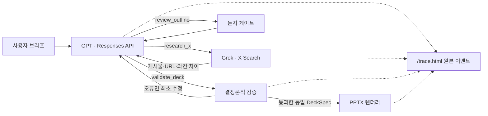

# Pipeline Architecture

## 순서에 의도가 있는 이유

`research_x`가 먼저인 이유는 GPT의 사전지식으로 “요즘 반응”을 추정하지 않기 위해서다.
Grok의 역할은 X 접근으로 한정한다. GPT는 검색 결과를 근거로 주장과 순서를 만든다.
`review_outline`은 슬라이드를 쓰기 전에 목차형 구성을 막아 재작업 비용을 줄인다.
`validate_deck`은 모델의 자기평가가 아니라 코드 규칙이다. 수치에 URL이 없거나 첫 장/마지막 장
구조가 틀리면 렌더링하지 않는다. `render_deck`은 동일 실행에서 통과한 정확히 같은 덱만 허용해
검증 뒤 내용을 바꾸는 우회를 차단한다.

## 적응과 실패 처리

- 검색 키가 없으면 `MOCK X RESEARCH`를 명시한 리허설 자료를 만든다.
- X URL을 추출하지 못하면 수치 주장을 쓰지 말라는 경고를 GPT에 반환한다.
- 잘못된 도구 인자는 구조화 오류로 돌아가며 서버는 최대 8라운드에서 정지한다.
- 검증 실패 시 보고된 결함만 수정하고 최대 두 번 다시 검사한다.
- X 게시물은 여론의 증거이지 게시물 속 사실의 증명으로 취급하지 않는다.

## 두 화면 계약

`src/agent/runner.ts`는 SDK의 `function_call`을 그대로 내보내고, Responses API로 되돌려 보내는
`function_call_output` 객체도 그대로 내보낸다. xAI 응답 output item도 필드 변경 없이 이벤트로
전달한다. `/trace.html`은 표시를 위해 `JSON.stringify(payload, null, 2)`만 수행한다.

