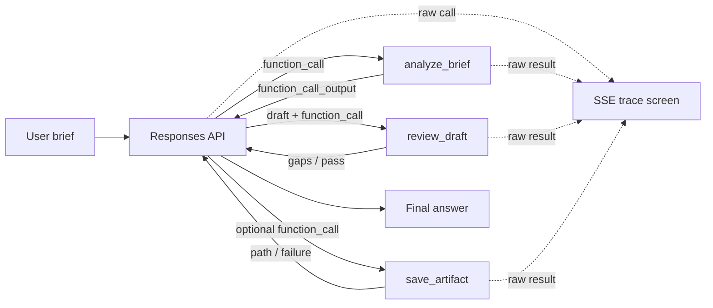

# Pipeline Architecture

## Runtime flow

## Why this order exists

1. `analyze_brief` converts vague input into testable constraints before creative work begins.
2. The model drafts after it understands the brief; drafting is not hidden inside a generic tool.
3. `review_draft` provides a deterministic guardrail and concrete revision signal.
4. The model may revise once, preventing both premature delivery and endless loops.
5. `save_artifact` is last and optional because persistence is a side effect, not a prerequisite.

## Adaptability and failure behavior

- Tool choice remains with the model; the server does not hard-code a fixed sequence.
- A six-round cap prevents runaway loops.
- Tool argument validation returns structured errors rather than crashing the process.
- A failed tool result is returned to the model so it can explain or choose an alternative.
- Missing API credentials activate an explicit mock mode for UI and trace rehearsal only.

## Raw-event contract

`src/agent/runner.ts` emits the SDK `function_call` item without changing its fields. It then emits
the exact `function_call_output` object sent back to the Responses API. `/trace.html` only applies
`JSON.stringify(payload, null, 2)` for whitespace; it does not rename, summarize, or remove fields.

Secrets are excluded by design: the OpenAI API key is used only to construct the SDK client and is
never placed in a tool argument, trace event, browser response, or artifact.

