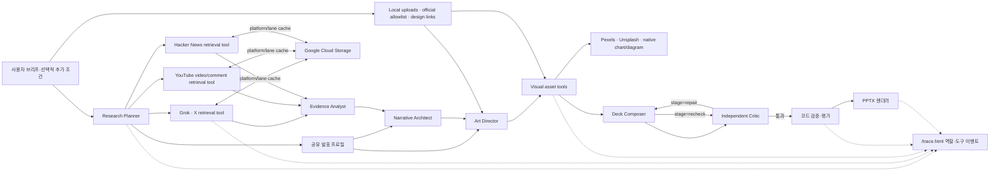

# Pipeline Architecture

## 순서에 의도가 있는 이유

Research Planner가 먼저인 이유는 요청문에서 목적·청중·발표 상황·말투·시각 방향을 한 번 결정해
후속 역할이 같은 맥락을 공유하게 하고, 모델의 사전지식으로 “요즘 반응”을 추정하지 않은 채 주제 불만과
AI PPT·디자인 비판을 별도 검색 레인으로 만들기 위해서다. 사용자가 추가 조건을 적으면 추론보다 우선한다.
Grok은 X 추출로 한정하고 YouTube 검색 도구는 공개 영상의 상위 댓글만 정규화한다. 영상 언어로 댓글 작성자의
국가를 추정하지 않으며, 국가별 불만 신호는 X를 우선한다. Evidence Analyst 이후의 각 역할은 별도 Responses API 컨텍스트와
JSON 계약만 사용한다.
여기서 X·YouTube·Hacker News는 에이전트가 아니라 Research Planner의 계획을 실행하는 검색 도구다. 모델 역할은
Research Planner, Evidence Analyst, Narrative Architect, Art Director, Deck Composer,
Independent Critic의 정확히 6개다.
Art Director는 슬라이드마다 `visualAssetType`을 정하고, 외부 이미지가 필요할 때만 `ImageIntent`를 만든다.
이어지는 검색·쿼터·다운로드와 네이티브 차트·구조도 계획은 에이전트가 아닌 결정론적 도구다. 사용자 업로드,
허용된 공식 URL, Pexels, Unsplash 후보는 제한된 수만 검토하고 선택된 후보만 다운로드한다. 차트는 검증된
`stats`, 구조도는 검증된 `bullets`에서만 생성된다. Deck Composer 뒤에는 코드가 동일 실행의
`SelectedImage`를 다시 주입하고 렌더러가 SHA-256을 확인하므로 모델이 경로나 자산을 바꿀 수 없다.
Dribbble 공개 URL은 Art Director의 디자인 참고일 뿐 이미지나 사실 근거로 복사하지 않는다.
`validate_deck`은 모델의 자기평가가 아니라 코드 규칙이다. 수치에 URL이 없거나 첫 장/마지막 장
구조가 틀리면 렌더링하지 않는다. `render_deck`은 동일 실행에서 통과한 정확히 같은 덱만 허용해
검증 뒤 내용을 바꾸는 우회를 차단한다.
`evaluate_deck`은 검증을 통과한 DeckSpec의 서사·미학 의도·시각적 리듬을 점검하고, 필요한 경우
가장 작은 부분만 다시 생성하도록 한다.

## 적응과 실패 처리

- OpenAI 키가 없으면 기존 결정론적 mock 리허설을 사용한다.
- X, YouTube, Hacker News 중 하나가 실패하면 다른 출처로 계속하되 Evidence Analyst에 제한사항을 전달한다.
- 팀의 각 역할은 출력 토큰 상한과 전체 실행 예산을 가진다.
- 비평 또는 코드 검증 실패 시 한 번의 국소 repair와 critic recheck만 허용한다.
- Art Director의 슬라이드 ID·순서·레이아웃 지시는 DeckSpec까지 그대로 이어지며, 렌더할 입력이 없는
  레이아웃은 코드가 차단한다.
- X 게시물과 YouTube 댓글은 대화의 증거이지 그 안의 사실 주장을 자동 증명하지 않는다.

## 두 화면 계약

팀 모드의 각 역할은 Responses API에 실제로 넘긴 요청 객체를 `tool_call`로, 모델이 돌려준
`output` 항목과 `output_text`를 `tool_result`로 내보낸다. 결과 이벤트는 스키마 파싱보다 먼저
방출하므로 계약 위반도 화면에 남는다. Grok의 검색 output item과 YouTube의 요청·정규화 결과, 수집된
커뮤니티 게시물과 출처 카탈로그도 전달한다. GCS cache hit도 플랫폼·레인과 함께 동일한 정규화 결과
경계를 표시한다. 단일 fallback은 기존 `function_call`과 `function_call_output`을 유지한다.
`/trace.html`은 이벤트 payload를 그대로 JSON 표시하며 서버 재시작 시 사라지는 메모리 버퍼만 사용한다.
