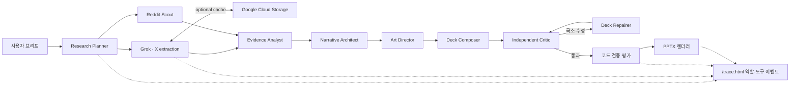

# Pipeline Architecture

## 순서에 의도가 있는 이유

Research Planner가 먼저인 이유는 모델의 사전지식으로 “요즘 반응”을 추정하지 않고 주제 불만과
AI PPT·디자인 비판을 별도 검색 레인으로 만들기 위해서다. Grok은 X 추출로 한정하고 Reddit Scout는
공개 게시물 레코드만 정규화한다. Evidence Analyst 이후의 각 역할은 별도 Responses API 컨텍스트와
JSON 계약만 사용한다.
`validate_deck`은 모델의 자기평가가 아니라 코드 규칙이다. 수치에 URL이 없거나 첫 장/마지막 장
구조가 틀리면 렌더링하지 않는다. `render_deck`은 동일 실행에서 통과한 정확히 같은 덱만 허용해
검증 뒤 내용을 바꾸는 우회를 차단한다.
`evaluate_deck`은 검증을 통과한 DeckSpec의 서사·미학 의도·시각적 리듬을 점검하고, 필요한 경우
가장 작은 부분만 다시 생성하도록 한다.

## 적응과 실패 처리

- OpenAI 키가 없으면 기존 결정론적 mock 리허설을 사용한다.
- X 또는 Reddit이 실패하면 다른 출처로 계속하되 Evidence Analyst에 제한사항을 전달한다.
- 팀의 각 역할은 출력 토큰 상한과 전체 실행 예산을 가진다.
- 비평 또는 코드 검증 실패 시 한 번의 국소 repair와 critic recheck만 허용한다.
- X·Reddit 게시물은 대화의 증거이지 게시물 속 사실의 증명으로 취급하지 않는다.

## 두 화면 계약

팀 모드는 역할 이름, 입력·출력 크기, 토큰 사용량과 검색 결과 개수를 이벤트로 내보낸다. xAI의
검색 output item은 원본 이벤트로 전달한다. 단일 fallback은 기존 `function_call`과
`function_call_output`을 유지한다. `/trace.html`은 이벤트 payload를 그대로 JSON 표시한다.
